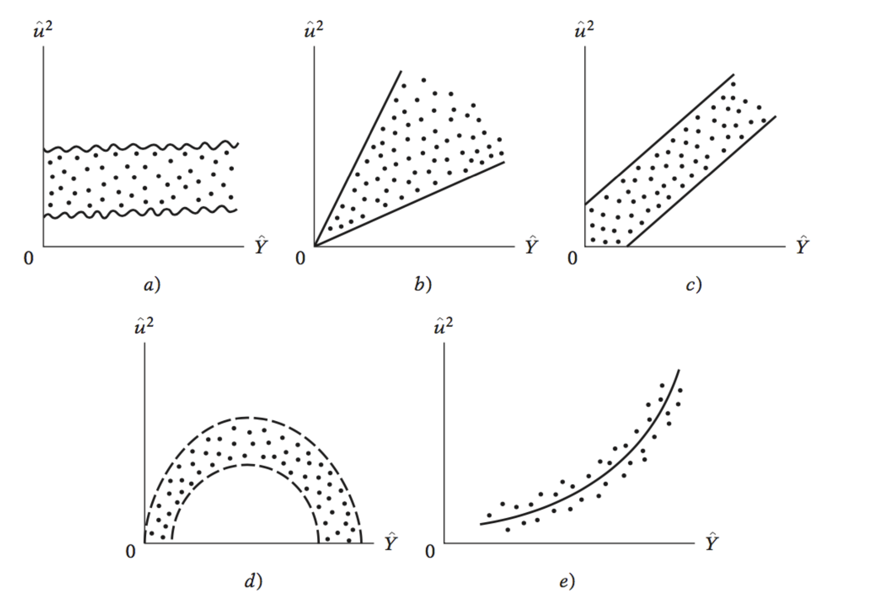
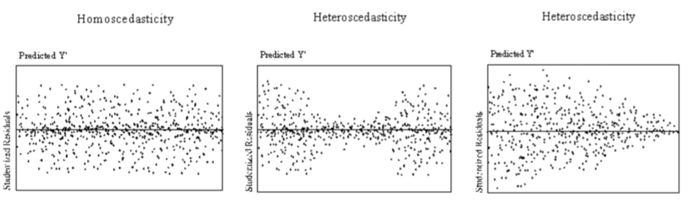
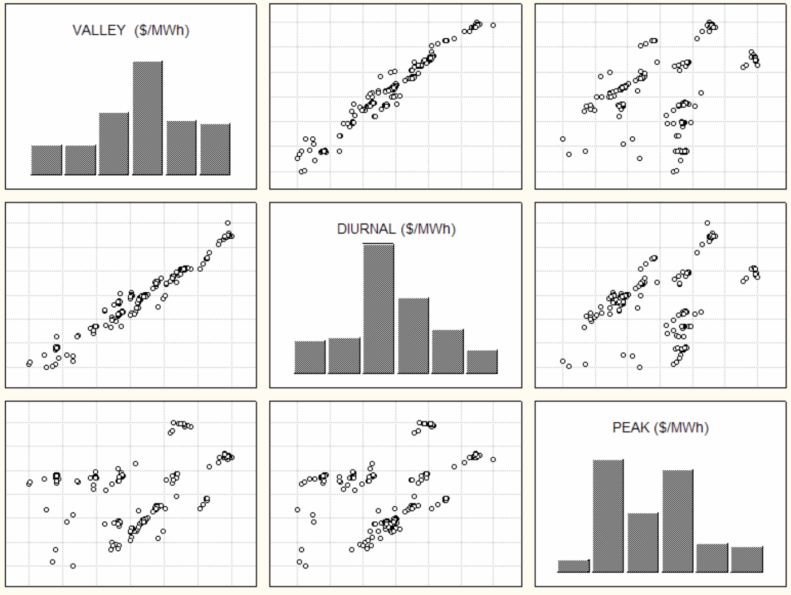

```{r, warning=F, message=FALSE}
knitr::opts_chunk$set(warning = FALSE, message = FALSE) 
library(tidyverse)
library(tidymodels)
```

# 1. Homoscedasticidad

En el contexto de regresiones lineales, un modelo presenta heteroscedasticidad cuando la varianza de los residuales (o errores) no permanece constante en las observaciones. Como consecuencia, uno de los supuestos presentados para la regresión lineal se rompe. Esto se debe a un gran número de factores, pero algunos casos donde se presenta heteroscedasticidad son:

- Datos provientes de distintas distribuciones de probabilidad con varianza distinta

- Información de ingresos y gastos en hogares, ya que a mayor ingreso los gastos tienen a ser más variables y de distintos rubros. 

- Información de habilidad en cierta labor y producción o efectividad. Al tener poca habilidad suele existir mayor varianza que cuando se tiene un nivel de habilidad muy alto. 

Como caso general, pero sin ser regla, la información con corte transversal suele tener más frecuentemente casos de heteroscedasticidad que en series de tiempo. 

## Consecuencias

- Al no tener varianzas constantes, implica que el teorema de Gauss-Markov no aplica, entonces los estimadores por MCO no son los Mejores Estimadores Insesgados, y su varianza no es la minima sobre los estimadores insesgados. 
- Las conclusiones de la prueba T y F no podrán ser utilizadas

## Detección

### Métodos gráficos
Analizando los residuales se pueden observar patrones, esto lo podemos realizar graficando los **residuales al cuadrado** con respecto al valor de $\hat{Y}$. Por ejemplo los siguientes casos:




Lo que se esperaría es que los residuales se distribuyan con una varianza constante. En la gráfica de arriba podemos ver que :

- a) presenta varianza constante
- b) la varianza es proporcional a $\hat{Y}$
- c) la varianza es proporcional a $\hat{Y}$
- d) la varianza es proporcional a $\hat{Y}^2$
- e) la varianza es proporcional a $\hat{Y}^2$

Hay varias alternativas para métodos graficos, por ejemplo siguiente imagen:



### Corrección. 
Dependiendo del caso visto anteriormente se pueden aplicar distintas transformaciones para corregirlos:

- a) No se realiza transformación
- b) sqrt(Y)
- c) sqrt(Y)
- d) ln(Y) o se divide entre Y
- e) ln(Y) o se divide entre Y

### Prueba de Breusch-Pagan
Para realizar una prueba de hipótesis que determine la heteroscedasticidad se puede aplicar la prueba de Breusch-Pagan. Esta prueba determina si la varianza de los errores de una regresión es dependiente de las variables independientes (en cuyo caso se presenta heteroscedasticidad).

Bajo $H_0:$ Se presenta Homoscedasticidad, $H_1:$ no presenta Homoscedasticidad

```{r}
library(performance)
library(tidyverse)
library(tidymodels)
mtcars_lm <- 
  linear_reg() %>% 
  fit(mpg ~wt + qsec+am, data = mtcars)

tidy(mtcars_lm)
glance(mtcars_lm)

bind_cols(
  mtcars_lm$fit$residuals %>% data.frame() %>% 
  set_names("residuales"),
  mtcars_lm$fit$fitted.values %>% data.frame() %>% 
  set_names("yhat")
) %>% 
  ggplot(aes(y = residuales, x = yhat))+
  geom_point()+
  theme_minimal()
```

# 2. Multicolinealidad

La multicolinealidad implica que existe una relación lineal entre las variables independientes (o un subconjunto de ellas). Esto quiere decir que parte o la totalidad de una variable se puede explicar como la suma ponderada de las demás variables. 

Se dice que existe multicolinealidad perfecta si se puede explicar en su totalidad a alguna variable independiente usando las demás. Matemáticamente lo podemos ver como:

$$\lambda_1 X_1  + \lambda_2 X_2 + .. + \lambda_k X_k = 0$$

Dentro del modelo de regresión lineal se supone que no hay multicolinealidad entre las variables porque:

- Si existe multicolinealidad perfecta, entonces la matriz inversa $(X^TX)^{-1}$ se indetermina, por lo que los coeficientes son indeterminados
- Si no es perfecta, los coeficientes tendrán un error estándar muy alto (por lo tanto es más dificil que sean significativos)

## Detección

### Métodos gráficos

Al realizar diagrama de dispersión entre todas las variables, se puede observar si existe alguna relación lineal

### VIF (Variance Inflation Factor)

El VIF nos ayuda a medir la colinealidad en el análisis de regresión

- VIF = 1: variables no están correlacionadas
- VIF entre 1 y 5: variables están moderadamente correlacionadas
- VIF > 5: variables están altamente correlacionadas

```{r}
library(GGally)
datos <- 
  data.frame(
    pesos = c(5, 4,3, 2, 1) ,
    dolares = c(100, 80, 60, 39, 21),
    cantidad = c(9, 21, 32, 41, 50)
  )

model_1 <- linear_reg() %>% 
  fit(cantidad ~ pesos+ dolares, data = datos)
tidy(model_1)
glance(model_1 )

ggpairs(datos)

model_1 %>% extract_fit_engine() %>% check_collinearity()
```

### Correcciones

- Reducir número de variables
- Transformar variables para que sean independientes entre ellas
- Otros métodos más avanzados como PCA

# 3. Análisis de residuales (diagnostico de modelo)
```{r}
mtcars_lm %>% check_model()
```


```{r}
mtcars_lm %>% extract_fit_engine() %>% check_heteroscedasticity()
mtcars_lm %>% extract_fit_engine() %>% check_collinearity()
mtcars_lm %>% extract_fit_engine() %>% check_normality()
mtcars_lm %>% extract_fit_engine() %>% check_outliers()
```

